# 🛡️ RAKSHAK — Income Shield for India's Delivery Warriors

> **Team : Code Warriors** (SRM University AP)

```
"Rakshak" (रक्षक) = Protector in Sanskrit.
When the rain stops your ride — Rakshak pays you.
Automatically. Fairly. Based on income actually lost.
```

## 📋 Table of Contents

<table border="1" cellpadding="8" cellspacing="0" width="100%" style="border-collapse: collapse;">
<tr style="border-bottom: 2px solid #333;">
<td align="center" width="5%" style="font-weight: bold;"><b>#</b></td>
<td align="left" style="font-weight: bold;"><b>Section</b></td>
</tr>
<tr>
<td align="center"><b>1</b></td>
<td><b><a href="#1-the-problem">The Problem</a></b></td>
</tr>
<tr>
<td align="center"><b>2</b></td>
<td><b><a href="#2-our-solution">Our Solution</a></b></td>
</tr>
<tr>
<td align="center"><b>3</b></td>
<td><b><a href="#3-persona--who-we-protect">Persona — Who We Protect</a></b></td>
</tr>
<tr>
<td align="center"><b>4</b></td>
<td><b><a href="#4-complete-platform-workflow">Complete Platform Workflow</a></b></td>
</tr>
<tr>
<td align="center"><b>5</b></td>
<td><b><a href="#5-system-architecture">System Architecture</a></b></td>
</tr>
<tr>
<td align="center"><b>6</b></td>
<td><b><a href="#6-parametric-triggers">Parametric Triggers</a></b></td>
</tr>
<tr>
<td align="center"><b>7</b></td>
<td><b><a href="#7-weekly-premium-model">Weekly Premium Model</a></b></td>
</tr>
<tr>
<td align="center"><b>8</b></td>
<td><b><a href="#8-ai--ml-integration">AI / ML Integration</a></b></td>
</tr>
<tr>
<td align="center"><b>9</b></td>
<td><b><a href="#10-platform-choice">Platform Choice</a></b></td>
</tr>
<tr>
<td align="center"><b>10</b></td>
<td><b><a href="#11-tech-stack">Tech Stack</a></b></td>
</tr>
<tr>
<td align="center"><b>11</b></td>
<td><b><a href="#12-system-scalability">System Scalability</a></b></td>
</tr>
<tr>
<td align="center"><b>12</b></td>
<td><b><a href="#13-business-viability">Business Viability</a></b></td>
</tr>
<tr>
<td align="center"><b>13</b></td>
<td><b><a href="#14-what-rakshak-does-not-cover">What Rakshak Does NOT Cover</a></b></td>
</tr>
<tr>
<td align="center"><b>14</b></td>
<td><b><a href="#15-team">Adversarial Defense & Anti-Spoofing Strategy</a></b></td>
</tr>
<tr>
<td align="center"><b>15</b></td>
<td><b><a href="#15-team">Team</a></b></td>
</tr>
</table>


---

## 1. The Problem

India has *12+ million active food delivery partners* on Zomato and Swiggy.

| Reality | Impact |
|--------|--------|
| Average daily earnings | ₹600 – ₹900 |
| Income lost during disruptions | 20 – 30% per month |
| Disruption days per year (avg) | 18 – 22 days |
| Existing safety net | ❌ None |

When a Red Alert rainstorm hits Hyderabad, or AQI crosses 300 in Delhi, or a sudden bandh shuts down Mumbai — delivery partners *lose their entire day's income* with zero recourse. No employer, no union, no insurance was built for them.

---
## 2. Our Solution

Rakshak is an AI-enabled parametric income insurance platform built exclusively
for food delivery partners on Zomato, Swiggy, and similar platforms.

Rakshak combines parametric triggers with real delivery platform data to ensure payouts reflect actual income lost — not just the presence of a disruption event.

<table border="1" cellpadding="8" cellspacing="0" width="100%" style="border-collapse: collapse;">
<tr style="border-bottom: 2px solid #333;">
<td align="left" style="font-weight: bold;"><b>Core Feature</b></td>
<td align="left" style="font-weight: bold;"><b>What It Means</b></td>
</tr>
<tr>
<td><b>Mobile App + Web</b></td>
<td><b>Single backend supporting two frontends</b></td>
</tr>
<tr>
<td><b>Parametric</b></td>
<td><b>Payout triggered by data, not claim forms</b></td>
</tr>
<tr>
<td><b>AI-powered</b></td>
<td><b>1) Premium pricing + claim amount calculation<br/>2) Disruption monitoring + claim initiation<br/>3) Fraud detection</b></td>
</tr>
<tr>
<td><b>Weekly pricing</b></td>
<td><b>Multiple plans · dynamic prices aligned to gig pay cycles</b></td>
</tr>
<tr>
<td><b>Instant payout</b></td>
<td><b>UPI transfer immediately on claim approval</b></td>
</tr>
</table>

---

## 3. Persona — Who We Protect

*Segment:* Food Delivery Partners — Zomato & Swiggy


Name:         Ravi/Suresh/Farhan(composite persona) 
Age:          22 – 38 years
Education:    10th – 12th pass
Weekly earn:  ₹3,000 – ₹6,000
City:         Hyderabad , Bengaluru , Mumbai(pilot zones)
Pain point:   "Kal barish thi, ek bhi order nahi mila."
              (It rained yesterday, I got zero orders.)


### Real-World Persona Scenarios

*Scenario A — Ravi, Swiggy Partner, Hyderabad*
> IMD declares Red Alert. Rainfall exceeds 55mm/hr. Ravi cannot ride out.
> *Rakshak:* Weather trigger fires → claim auto-created → ₹600 UPI transfer in 6 minutes.
> Ravi receives  "Heavy rain confirmed in your zone. ₹600 credited. Stay safe."

*Scenario B — Suresh, Zomato Partner, Bengaluru (BTM Layout)*
> AQI hits 340 at 9 AM. Order volume in BTM drops 62% (platform crash trigger also fires).
> *Rakshak:*   AQI trigger or Platform demand drop trigger  → ₹1,062 payout processed.

*Scenario C — Farhan, Swiggy Partner, Mumbai*
> State-wide transport strike called. NewsAPI NLP detects "bandh Mumbai" with 91% confidence.
> *Rakshak:* Band Trigger → GPS confirms Farhan is in covered zone → ₹750 credited.


---
## 4. Complete Platform Workflow

> **The key design principle:** The trigger monitoring (Step 4) only detects *that* a disruption happened and *how long* it lasted. No money is decided there. All payout logic runs at **11:50 PM** when actual platform delivery data is available for cross-checking.

---

### STEP 1 — Worker Onboarding

<div align="center">

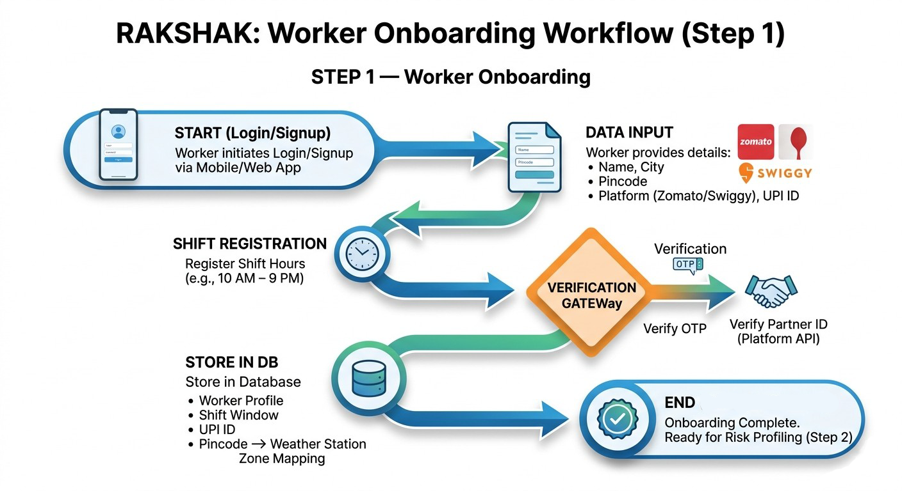

</div>

---

### STEP 2 — AI Risk Profiling (Policy Dynamic Pricing) *(ML )*

<div align="center">

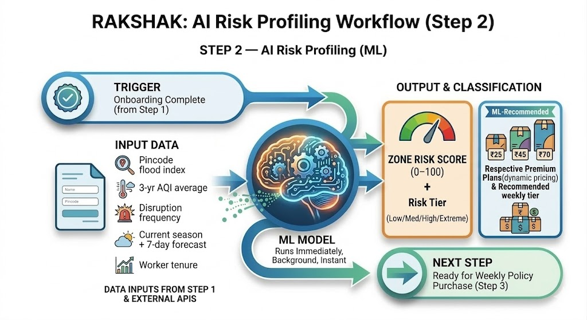

</div>


---

### STEP 3 — Weekly Policy Purchase
<div align="center">

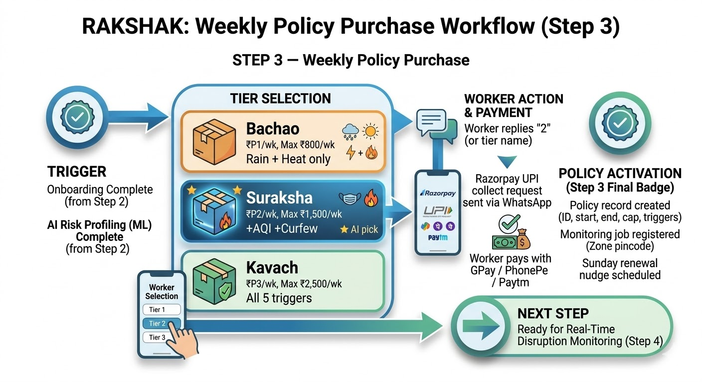

</div>

---

### STEP 4 — Real-Time Disruption Monitoring *(24/7)*

> **This step ONLY detects disruptions and records their duration. No payout amount is calculated here.**

<div align="center">

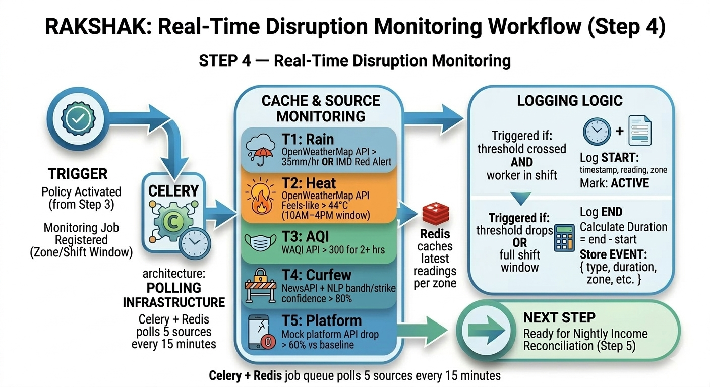

</div>

---
### STEP 5 — 11:50 PM Nightly Income Reconciliation

> **This is where payouts are actually calculated.**
> Runs once per day at **11:50 PM** after all disruption windows for the day are finalized.

<div align="center">

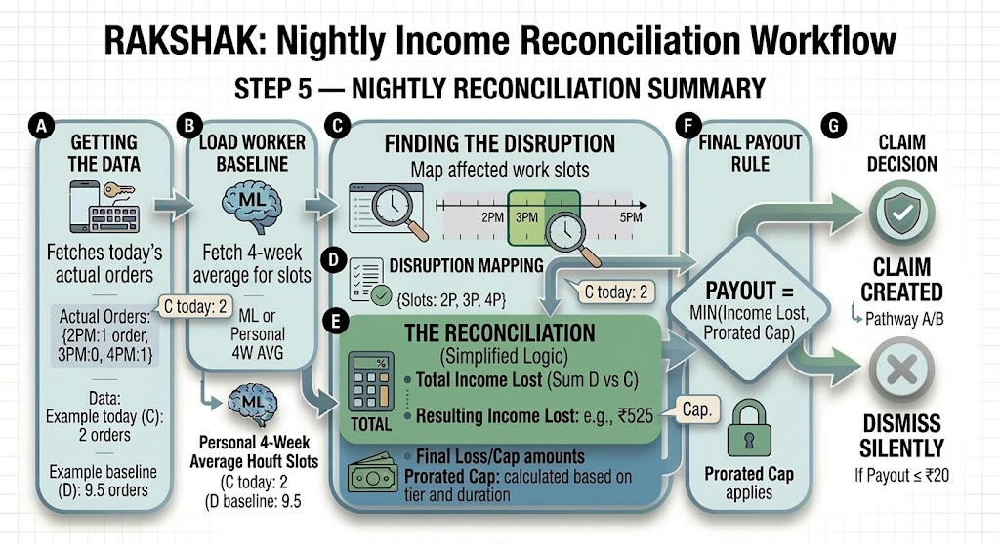

</div>
---

### STEP 6 — Claim Pathways

> Claims are created only after reconciliation confirms **real income loss**.

<div align="center">

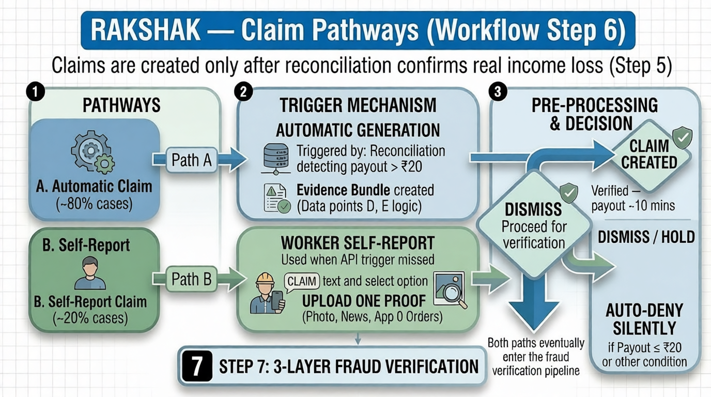

</div>

---

### STEP 7 — Multi-layered Fraud Verification

> Every Claim undergoes multi layer fraud verification and if the claim is genuine user gets payout instantly and User can also appeal for the rejected claims!

<div align="center">

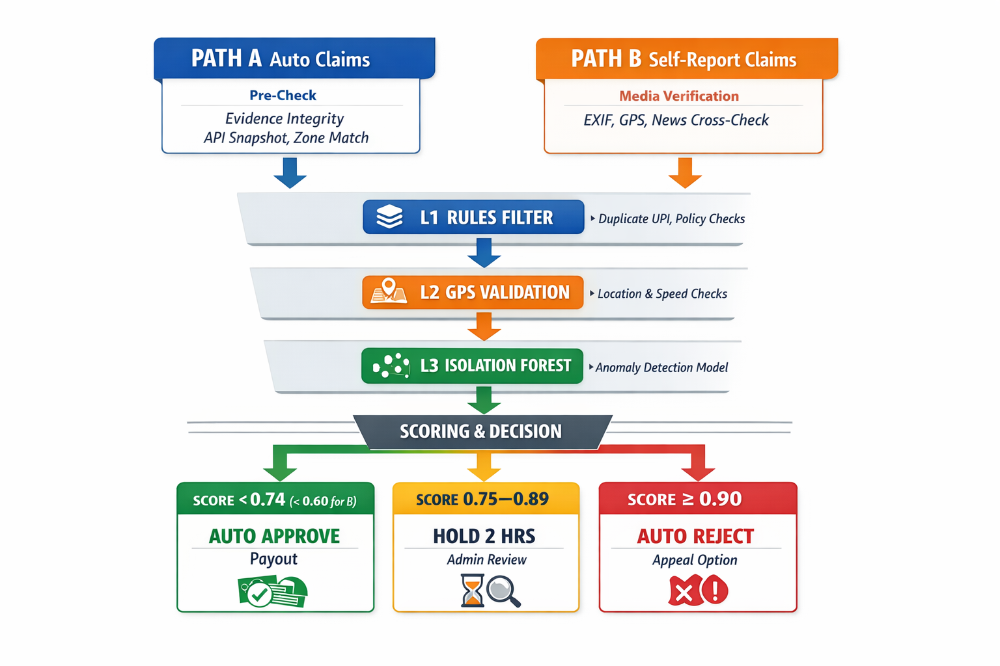

</div>


---

### STEP 8 — Instant UPI Payout

```
Triggered when:
  Claim passes fraud verification.

Payment flow:

  Razorpay Payout API
        │
        ▼
  Worker UPI ID

Transfer time:
  < 6 minutes
```

Worker receives WhatsApp confirmation:

```
"₹169 transferred successfully.

 Trigger: Heavy Rain
 Window: 2:15 PM – 4:30 PM
 Claim ID: XXXXX"
```

System ledger updates:

```
  ├─ Weekly payout cap reduced
  ├─ Claim marked SETTLED
  └─ Analytics event fired for insurer dashboard
```

### End-to-End System Flow (High Level)

1. Worker purchases a weekly policy.
2. Trigger Monitoring Service continuously checks disruption APIs
   (weather, AQI, news, platform data).
3. When thresholds are crossed, disruption events are recorded for the zone.
4. At 11:50 PM, the Income Loss Reconciliation Engine retrieves:
   • worker delivery data
   • historical baseline
5. Actual income loss is calculated.
6. Fraud detection pipeline verifies the claim.
7. Approved claims trigger instant UPI payouts via Razorpay.

---

## 5. System Architecture


Rakshak follows a modular, microservice-style architecture where independent
platform services interact through a centralized API gateway.

The system is composed of the following major layers:

- **API Gateway (Django REST)** — handles authentication, request routing, and rate limiting.
- **Core Platform Services** — worker onboarding, policy management, disruption monitoring, claims processing, and fraud detection.
- **AI / ML Services** — models for zone risk profiling, dynamic premium pricing, income-loss estimation, and anomaly-based fraud detection.
- **External Data Sources** — weather, AQI, news feeds, and delivery platform APIs used for disruption detection and income verification.
- **Payment Infrastructure** — instant claim payouts through Razorpay UPI.

### Architecture Highlights

• **Trigger Monitoring Service** continuously polls weather, AQI, and news APIs using scheduled Celery jobs.  
• When disruption thresholds are crossed, events are recorded for the affected geographic zone.  
• The **Claims & Reconciliation Engine** later validates these disruptions against delivery platform data to calculate actual income loss.
• AI/ML models support premium pricing, zone risk scoring, and fraud detection.  
• Approved claims are transferred instantly to workers through Razorpay UPI payouts.  
• **PostgreSQL** stores policies, claims, and worker profiles, while **Redis** caches trigger readings and real-time monitoring data.

---


## 6. Parametric Triggers (**Estimated)

<table border="2" cellpadding="12" cellspacing="0" width="100%" style="border-collapse: collapse; border: 2px solid #333;">
<tr style="border: 2px solid #333;">
<td align="center" width="8%"><b>#</b></td>
<td align="center" width="15%"><b>Trigger</b></td>
<td align="center" table clear and organized with professionallywidth="17%"><b>Data Source</b></td>
<td align="center" width="25%"><b>Threshold</b></td>
<td align="center" width="15%"><b>Payout Ceiling</b></td>
<td align="center" width="20%"><b>Notes</b></td>
</tr>
<tr style="border: 1px solid #333;">
<td align="center"><b>T1</b></td>
<td align="center"><b>Heavy Rain</b></td>
<td align="center"><b>OpenWeatherMap</b></td>
<td align="center"><b>> 35mm/hr OR IMD Red Alert</b></td>
<td align="center"><b>₹600/day</b></td>
<td align="center"><b>Real free API</b></td>
</tr>
<tr style="border: 1px solid #333;">
<td align="center"><b>T2</b></td>
<td align="center"><b>Extreme Heat</b></td>
<td align="center"><b>OpenWeatherMap</b></td>
<td align="center"><b>Feels-like > 44°C (10AM–4PM)</b></td>
<td align="center"><b>₹400/day</b></td>
<td align="center"><b>Peak hours only</b></td>
</tr>
<tr style="border: 1px solid #333;">
<td align="center"><b>T3</b></td>
<td align="center"><b>Hazardous AQI</b></td>
<td align="center"><b>WAQI API</b></td>
<td align="center"><b>AQI > 300 for 2+ hrs</b></td>
<td align="center"><b>₹500/day</b></td>
<td align="center"><b>Real free API</b></td>
</tr>
<tr style="border: 1px solid #333;">
<td align="center"><b>T4</b></td>
<td align="center"><b>Curfew/Bandh</b></td>
<td align="center"><b>NewsAPI + NLP</b></td>
<td align="center"><b>Keywords + confidence > 80%</b></td>
<td align="center"><b>₹750/day</b></td>
<td align="center"><b>NLP-scored</b></td>
</tr>
<tr style="border: 1px solid #333;">
<td align="center"><b>T5</b></td>
<td align="center"><b>Platform Drop</b></td>
<td align="center"><b>Mock Platform API</b></td>
<td align="center"><b>Order volume drop > 60%</b></td>
<td align="center"><b>₹350/day</b></td>
<td align="center"><b>Gig delivery specific</b></td>
</tr>
</table>

**"Payout rate" is a ceiling, not a flat amount.** Actual payout = MIN(prorated hourly rate × disruption hours, actual income loss calculated).


---

## 7. Weekly Premium Model

### Why weekly?

Gig workers earn daily and budget weekly. Monthly feels unaffordable. Weekly feels like skipping two chai breaks.

### Tiers (Example Plans)


<table border="2" cellpadding="12" cellspacing="0" width="100%" style="border-collapse: collapse; border: 2px solid #333;">
<tr style="border: 2px solid #333;">
<td align="center" width="25%"><b>Tier</b></td>
<td align="center" width="20%"><b>Price/Week</b></td>
<td align="center" width="20%"><b>Max Payout/Week</b></td>
<td align="center" width="35%"><b>Triggers Covered</b></td>
</tr>
<tr style="border: 1px solid #333;">
<td align="center"><b>Bachao (Basic)</b></td>
<td align="center"><b>₹29</b></td>
<td align="center"><b>₹800</b></td>
<td align="center"><b>T1 + T2 (Rain + Heat)</b></td>
</tr>
<tr style="border: 1px solid #333;">
<td align="center"><b>Suraksha (Standard) ★</b></td>
<td align="center"><b>₹49</b></td>
<td align="center"><b>₹1,500</b></td>
<td align="center"><b>T1 + T2 + T3 + T4 (Rain + Heat + AQI + Curfew)</b></td>
</tr>
<tr style="border: 1px solid #333;">
<td align="center"><b>Kavach (Premium)</b></td>
<td align="center"><b>₹79</b></td>
<td align="center"><b>₹2,500</b></td>
<td align="center"><b>All 5 Triggers + Composite Bonus</b></td>
</tr>
</table>

### Dynamic pricing (using ML model)


---

## 8. AI / ML Integration

Rakshak uses **4 distinct ML modules**, each at a different stage of the pipeline.

### Module 1 — Dynamic Premium Engine *(Step 2)*
```
Purpose:    Personalize weekly premium per worker per zone
Features:   Pincode flood index · season · 7-day forecast ·
            disruption frequency · worker tenure · claim history
Output:     Weekly price + zone risk tier
Update:     Every Sunday 11 PM
```

### Module 2 — Zone Risk Profiler *(Step 2)*
```
Algorithm:  K-Means Clustering on pincode-level disruption data
Purpose:    Cluster zones into risk tiers for heat-map + pricing input
Input:      IMD flood maps · WAQI records · curfew history per pincode
Output:     Risk Score 0–100 + Tier (Low/Medium/High/Extreme)
Visual:     Live heat-map on insurer admin dashboard
```

### Module 3 — Income Loss Calculator *(Step 5)*
```

Purpose:    Calculate actual income lost during disruption window
Inputs:     Worker's actual orders (platform API) · 4-week baseline ·
            disruption duration · avg earnings per order
Output:     Payout amount = MIN(actual loss, prorated cap)
Key logic:  Never pays more than actual loss. Never pays for time
            outside shift window. Never pays if worker performed above baseline.
```

### Module 4 — Isolation Forest Fraud Detector *(Step 7)*
```
Framework:  scikit-learn via Python FastAPI microservice
Features:   Claim frequency vs zone norm · earnings ratio ·
            device fingerprint uniqueness · time distribution ·
            claim-to-disruption correlation
Output:     Fraud Score 0.00–1.00
Routing:    < 0.74 auto-approve (Path A) · < 0.60 auto-approve (Path B)
            0.75–0.89 hold · > 0.90 reject
```


---
## 9. Platform Choice

**Decision: Mobile App + Web App for workers · Web Dashboard for admin · Single shared backend**

<table border="2" cellpadding="12" cellspacing="0" width="100%" style="border-collapse: collapse; border: 2px solid #333;">
<tr style="border: 2px solid #333;">
<td align="center" width="15%"><b>Layer</b></td>
<td align="center" width="20%"><b>Platform</b></td>
<td align="center" width="20%"><b>Users</b></td>
<td align="center" width="45%"><b>Reason</b></td>
</tr>
<tr style="border: 1px solid #333;">
<td align="center"><b>Worker Frontend</b></td>
<td align="center"><b>Mobile App (Primary)</b></td>
<td align="center"><b>Delivery Partners</b></td>
<td align="center"><b>·Native GPS <br/>· Push notifications<br/> ·Camera upload<br/> · UPI deep-links</b></td>
</tr>
<tr style="border: 1px solid #333;">
<td align="center"><b>Worker Frontend</b></td>
<td align="center"><b>Web App (PWA)</b></td>
<td align="center"><b>Delivery Partners</b></td>
<td align="center"><b>·Browser access <br/>· No install <br/>· Same features as app</b></td>
</tr>
<tr style="border: 1px solid #333;">
<td align="center"><b>Admin Frontend</b></td>
<td align="center"><b>Web Dashboard</b></td>
<td align="center"><b>Insurer / Ops Team</b></td>
<td align="center"><b>·Heat-maps <br/>· Fraud queue <br/>· Analytics <br/>· Bulk actions</b></td>
</tr>
<tr style="border: 1px solid #333;">
<td align="center"><b>Backend</b></td>
<td align="center"><b>Single REST API</b></td>
<td align="center"><b>All Frontends</b></td>
<td align="center"><b>·One codebase <br/>· No duplication <br/>· Instant propagation</b></td>
</tr>
</table>


### Why both Mobile + Web for workers?

- **Mobile App** — best experience for active delivery partners.
  Native GPS tracking, camera for proof upload, UPI deep-links,
  push notifications for instant payout alerts. Works offline for
  claim drafting, syncs when reconnected.

- **Web App** — fallback for workers without storage space or those
  on older devices. Same features, accessible from any browser.
  No install friction. Shareable via WhatsApp link.

- **Single backend** — both frontends hit the same REST API.
  Claim logic, fraud detection, payout rules all live in one place.
  One change propagates to both platforms instantly.


---

## 10. Tech Stack
### Backend
<table border="2" cellpadding="12" cellspacing="0" width="100%" style="border-collapse: collapse; border: 2px solid #333;">
<tr style="border: 2px solid #333;">
<td align="center" width="40%"><b>Component</b></td>
<td align="center" width="60%"><b>Technology</b></td>
</tr>
<tr style="border: 1px solid #333;">
<td align="center"><b>API Server</b></td>
<td align="center"><b>Django</b></td>
</tr>
<tr style="border: 1px solid #333;">
<td align="center"><b>ML Service</b></td>
<td align="center"><b>Python</b></td>
</tr>
<tr style="border: 1px solid #333;">
<td align="center"><b>ML Models</b></td>
<td align="center"><b>scikit-learn</b></td>
</tr>
<tr style="border: 1px solid #333;">
<td align="center"><b>Database</b></td>
<td align="center"><b>PostgreSQL</b></td>
</tr>
<tr style="border: 1px solid #333;">
<td align="center"><b>Cache</b></td>
<td align="center"><b>Redis - real-time trigger readings per zone</b></td>
</tr>
<tr style="border: 1px solid #333;">
<td align="center"><b>Job Queue</b></td>
<td align="center"><b>Celery + Redis - 15-min trigger polling + 11:50 PM reconciliation batch</b></td>
</tr>
</table>

### Frontend
<table border="2" cellpadding="12" cellspacing="0" width="100%" style="border-collapse: collapse; border: 2px solid #333;">
<tr style="border: 2px solid #333;">
<td align="center" width="40%"><b>Component</b></td>
<td align="center" width="60%"><b>Technology</b></td>
</tr>
<tr style="border: 1px solid #333;">
<td align="center"><b>Web Dashboard (Admin + User)</b></td>
<td align="center"><b>React.js + Tailwind CSS</b></td>
</tr>
<tr style="border: 1px solid #333;">
<td align="center"><b>Mobile App</b></td>
<td align="center"><b>Flutter</b></td>
</tr>
</table>

### Integrations (Subjected to change)
<table border="2" cellpadding="12" cellspacing="0" width="100%" style="border-collapse: collapse; border: 2px solid #333;">
<tr style="border: 2px solid #333;">
<td align="center" width="25%"><b>Service</b></td>
<td align="center" width="35%"><b>Tool</b></td>
<td align="center" width="40%"><b>Mode</b></td>
</tr>
<tr style="border: 1px solid #333;">
<td align="center"><b>Weather (T1, T2)</b></td>
<td align="center"><b>OpenWeatherMap API</b></td>
<td align="center"><b>Free Tier</b></td>
</tr>
<tr style="border: 1px solid #333;">
<td align="center"><b>AQI (T3)</b></td>
<td align="center"><b>WAQI API</b></td>
<td align="center"><b>Free Tier</b></td>
</tr>
<tr style="border: 1px solid #333;">
<td align="center"><b>Curfew (T4)</b></td>
<td align="center"><b>NewsAPI + Custom NLP</b></td>
<td align="center"><b>Free Tier</b></td>
</tr>
<tr style="border: 1px solid #333;">
<td align="center"><b>Platform Data (T5 + Reconciliation)</b></td>
<td align="center"><b>Custom Mock API</b></td>
<td align="center"><b>Simulated JSON</b></td>
</tr>
<tr style="border: 1px solid #333;">
<td align="center"><b>Payments</b></td>
<td align="center"><b>Razorpay</b></td>
<td align="center"><b>Test Mode</b></td>
</tr>
<tr style="border: 1px solid #333;">
<td align="center"><b>Maps / Zone Boundaries</b></td>
<td align="center"><b>Google Maps JS API</b></td>
<td align="center"><b>Free Tier</b></td>
</tr>
</table>

### Infrastructure
<table border="2" cellpadding="12" cellspacing="0" width="100%" style="border-collapse: collapse; border: 2px solid #333;">
<tr style="border: 2px solid #333;">
<td align="center" width="40%"><b>Component</b></td>
<td align="center" width="60%"><b>Service</b></td>
</tr>
<tr style="border: 1px solid #333;">
<td align="center"><b>Hosting</b></td>
<td align="center"><b>Railway.app / AWS EC2 t2.micro</b></td>
</tr>
<tr style="border: 1px solid #333;">
<td align="center"><b>Database</b></td>
<td align="center"><b>Supabase (PostgreSQL Free Tier)</b></td>
</tr>
<tr style="border: 1px solid #333;">
<td align="center"><b>CI/CD</b></td>
<td align="center"><b>GitHub Actions</b></td>
</tr>
</table>


---

## 11. System Scalability

Rakshak is designed to scale across millions of workers using a **zone-based
trigger monitoring model**.

Instead of running trigger checks individually for every worker:

• Disruption triggers are monitored **once per geographic zone**  
• Workers are mapped to zones using their registered pincode  
• A single disruption event is applied to all workers in that zone  

Example:

Heavy rain detected in **Hyderabad Zone 3**

→ Trigger recorded once  
→ Applied to all workers mapped to that zone  
→ Nightly reconciliation calculates income loss per worker

This architecture ensures the system can support **millions of workers
without linear infrastructure growth**.
---

---

## 12. Business Viability

| Metric | Estimate |
|--------|---------|
| Food delivery partners in India | ~12 million |
| Pilot cities (Hyderabad + Bengaluru + Mumbai) | ~900,000 |
| Average weekly premium | ₹49 |
| Annual revenue at 1% penetration | ₹22.8 Cr/year |
| Expected claim ratio | 35–45% of premium pool |
| Expected disruption days per partner/year | 18–22 |
| Target payout settlement time | < 12 min (reconciliation + transfer) |

**Why the hybrid model improves unit economics:**
Traditional parametric pays full daily rate whenever a trigger fires. Rakshak's reconciliation model pays only actual loss, bounded by a prorated cap. This reduces expected payout per event by an estimated 35–50% compared to flat-rate parametric — making the pool sustainable at lower premiums while still being meaningful to workers.

---

## 13. What Rakshak Does NOT Cover

Per the Guidewire DEVTrails Golden Rules:

```
❌  Health or medical expenses
❌  Accident injuries or hospitalization
❌  Vehicle repair or maintenance costs
❌  Life insurance
❌  Theft of personal property
❌  Vehicle EMI support

✅  Rakshak covers ONE thing only:
    INCOME LOST due to external, uncontrollable disruptions —
    verified against actual delivery data, not just weather readings.
```

---
 
## 14. Adversarial Defense & Anti-Spoofing Strategy
 
> **The Threat:** 500 delivery workers used GPS-spoofing apps to fake locations inside a
> weather alert zone — draining a competitor's liquidity pool in hours.
> Below is why that attack fails on Rakshak, and the additional layers we added to make it airtight.
 
---
 
### 🛡️ Why Rakshak Is Structurally Resistant
 
The competitor was exploited because their **GPS directly triggered payouts.**
Rakshak's triggers are completely independent of the worker's phone.
 
```
Competitor:   Fake GPS in rain zone  →  Payout fires          ❌ (exploited)
 
Rakshak:      Fake GPS in rain zone  →  Trigger = OpenWeatherMap (not the phone)
                                     →  Payout = delivery data cross-check at 11:50 PM
                                     →  Fraudster at home = OFFLINE on Swiggy
                                     →  No income loss found = No payout  ✅
```
 
> A spoofed phone cannot change what OpenWeatherMap reports.
> A fraudster at home cannot fake an active Swiggy delivery session.
 
**Remaining gap closed below:** 500 workers all going offline needs one more layer to distinguish
a genuinely stranded worker from a syndicate member at home.
 
---
 
### 1. The Differentiation — Real Worker vs. Spoofer
 
Our ML pipeline checks **5 signals that no GPS spoofing app can override:**
 
<table border="2" cellpadding="10" cellspacing="0" width="100%" style="border-collapse: collapse; border: 2px solid #333;">
<tr style="border: 2px solid #333;">
<td align="center" width="5%"><b>#</b></td>
<td align="center" width="25%"><b>Signal</b></td>
<td align="center" width="35%"><b>✅ Real Worker</b></td>
<td align="center" width="35%"><b>❌ Spoofer at Home</b></td>
</tr>
<tr style="border: 1px solid #333;">
<td align="center"><b>S1</b></td>
<td><b>Delivery App Session</b></td>
<td>Was ONLINE on Swiggy/Zomato, went offline as rain worsened</td>
<td>Never opened the delivery app — zero session that day</td>
</tr>
<tr style="border: 1px solid #333;">
<td align="center"><b>S2</b></td>
<td><b>Accelerometer (Built-in Hardware)</b></td>
<td>Bike vibration pattern detected — was physically riding</td>
<td>Flat, still readings all day — phone sitting on a table</td>
</tr>
<tr style="border: 1px solid #333;">
<td align="center"><b>S3</b></td>
<td><b>Network Fingerprint</b></td>
<td>Connected to street cell towers inside the disruption zone</td>
<td>Home Wi-Fi router detected — GPS says Banjara Hills, network says otherwise</td>
</tr>
<tr style="border: 1px solid #333;">
<td align="center"><b>S4</b></td>
<td><b>Zone Delivery History</b></td>
<td>Has actual past orders from this pincode in last 4 weeks</td>
<td>Zero prior delivery activity in this zone — first visit is a payout event</td>
</tr>
<tr style="border: 1px solid #333;">
<td align="center"><b>S5</b></td>
<td><b>Pre-Disruption Movement</b></td>
<td>GPS trail shows normal delivery route before rain started</td>
<td>GPS teleports into zone — no approach path, no prior stops</td>
</tr>
</table>
 
```
5 / 5 signals pass  →  Genuine   →  Auto-approve
3 – 4 pass          →  Probable  →  Approve + silent monitoring
1 – 2 pass          →  Flagged   →  Soft hold, one quick action required
0 pass              →  Fraud     →  Reject + ring investigation triggered
```
 
---
 
### 2. The Data — Beyond GPS Coordinates
 
**Passive signals collected by the Flutter app (zero extra steps for worker):**
 
```
· Accelerometer variance       → moving like a delivery bike, or sitting still?
· Network BSSID hash           → street cell tower or home Wi-Fi router?
· Connectivity quality         → storm zone = dropped signal | home = stable connection
· Delivery app online duration → how many minutes were they active in the zone?
· 30-day zone delivery history → do they normally even work in this area?
```
 
 
### 3. The UX Balance — Honest Workers Always Protected
 
```
Core rule: Bad signal in a storm ≠ fraud. Never penalize the exact condition that caused the claim.
```
 
<table border="2" cellpadding="10" cellspacing="0" width="100%" style="border-collapse: collapse; border: 2px solid #333;">
<tr style="border: 2px solid #333;">
<td align="center" width="18%"><b>Fraud Score</b></td>

<td align="center" width="20%"><b>Outcome</b></td>
<td align="center" width="44%"><b>Worker Experience</b></td>
</tr>
<tr style="border: 1px solid #333;">
<td align="center"><b>&lt; 0.60</b></td>

<td align="center"><b>✅ Instant Payout</b></td>
<td>UPI transfer immediately. Zero friction.</td>
</tr>
<tr style="border: 1px solid #333;">
<td align="center"><b>0.60 – 0.74</b></td>

<td align="center"><b>✅ Payout + Watch</b></td>
<td>Paid normally. Silently monitored. Worker sees nothing different.</td>
</tr>
<tr style="border: 1px solid #333;">
<td align="center"><b>0.75 – 0.89</b></td>

<td align="center"><b>⏸ Soft Hold</b></td>
<td><i>"Send one location photo or tap Confirm. 4-hour window. Payout follows immediately."</i></td>
</tr>
<tr style="border: 1px solid #333;">
<td align="center"><b>&gt; 0.90</b></td>

<td align="center"><b>❌ Reject + Appeal</b></td>
<td>Plain-language reason. One-tap appeal. Human review in 24 hrs.</td>
</tr>

</table>
 
**Protections built specifically for genuine bad-weather connectivity loss:**
 
```
1. GPS Grace Window    →  Dropped pings during active weather alert = expected, not flagged
2. Offline-First App   →  Flutter caches all sensor data locally, uploads when signal returns
3. Sensor Reweighting  →  During active storm: GPS weight reduced, accelerometer weight increased
```
 
---
 
### 🧱 Why GPS Bypass Still Fails — 3-Layer Fraud Verification
 
Every single claim on Rakshak passes through **3 independent layers** before any payout.
GPS validation sits at Layer 2. Even if a spoofer bypasses it — **2 layers are still waiting.**
 
```
┌─────────────────────────────────────────────────────────────────────┐
│                    3-LAYER FRAUD VERIFICATION                       │
├─────────────────────────────────────────────────────────────────────┤
│                                                                     │
│  LAYER 1 — Rule-Based Income Check                                  │
│  ─────────────────────────────────                                  │
│  · Was a real disruption event recorded in this zone?               │
│  · Did the worker have an active policy at that time?               │
│  · Does actual income loss exist vs 4-week baseline?                │
│  · Is the claim inside the disruption time window?                  │
│                                                                     │
│  → No real income loss found = claim dies here, GPS irrelevant      │
│                                                                     │
├─────────────────────────────────────────────────────────────────────┤
│                                                                     │
│  LAYER 2 — GPS Zone Validation          ⚠️ CAN BE SPOOFED           │
│  ──────────────────────────────────                                 │
│  · Is the worker's reported location inside the disruption zone?    │
│  · Does movement trajectory match the zone before disruption?       │
│  · Cross-checked against accelerometer + network fingerprint        │
│                                                                     │
│  → Spoofer fakes GPS ✓  but accelerometer is flat ✗                 │
│  → Spoofer fakes GPS ✓  but home Wi-Fi router detected ✗            │
│  → GPS alone bypassed — but the supporting signals catch it         │
│                                                                     │
├─────────────────────────────────────────────────────────────────────┤
│                                                                     │
│  LAYER 3 — Isolation Forest ML Anomaly Detection                    │
│  ────────────────────────────────────────────────                   │
│  · Claim frequency vs zone norm                                     │
│  · Earnings ratio vs historical baseline                            │
│  · Device fingerprint uniqueness                                    │
│  · Time distribution of claim submission                            │
│  · Claim-to-disruption correlation score                            │
│                                                                     │
│  Fraud Score:  < 0.74 → auto-approve                                │
│                0.75–0.89 → hold for review                          │
│                > 0.90 → reject                                      │
│                                                                     │
│  → Even if Layer 2 is bypassed, abnormal patterns surface here      │
│                                                                     │
└─────────────────────────────────────────────────────────────────────┘
```
 
> **The key insight:** GPS spoofing bypasses Layer 2 coordinate check.
> It cannot fabricate real income loss in Layer 1.
> It cannot hide abnormal claim patterns in Layer 3.
> **All 3 layers must be bypassed simultaneously — that has not happened.**
 
---
 
### 📍 Peer Zone Validation — The Crowd Witness
 
When a disruption is declared in a zone, Rakshak checks **how many other genuine workers
in the same zone experienced the same income drop.**
 
```
Disruption fires in Zone: Hyderabad — Banjara Hills
 
  Worker A (genuine) — ONLINE on Swiggy, income dropped 80%  ✅
  Worker B (genuine) — ONLINE on Swiggy, income dropped 75%  ✅
  Worker C (genuine) — ONLINE on Swiggy, income dropped 82%  ✅
  Worker X (spoofer) — OFFLINE all day, claims income drop    ❌
 
  Zone peer drop average = 79%
  Worker X reported income = normal (was at home, earning nothing to lose)
  Worker X claim pattern = outlier vs zone peers → flagged
```
 
**Why this matters:** A genuine disruption creates a consistent income loss pattern
across all workers in that zone. A spoofer's claim sticks out because their
delivery data doesn't match the zone's crowd behaviour.
 
```
Peer Zone Score = how closely a worker's income pattern
                  matches the zone average during the event
 
High match  →  Supports genuine claim
Low match   →  Anomaly flag added to Isolation Forest score
```
 
---
 
### 🔐 Defense in Depth
 
```
 Attack: GPS Spoofing
     │
     ├─► Layer 1 — Triggers from OpenWeatherMap, not the phone         → spoof irrelevant
     ├─► Layer 2 — 11:50 PM delivery data cross-check                  → no session = no payout
     ├─► Layer 3 — Accelerometer + Network fingerprint                 → physical presence proven
     └─► Layer 4 — Tiered response with appeals                        → honest workers protected
```
 
> A spoofer must simultaneously fake their **delivery session**, **phone motion**,
> **network router**, **30-day zone history**, and **beat 4 ring alarms** — all at once.
>
> **That is not a vulnerability. That is a trap.**


### 🗺️ Ground Truth — Platform-Enforced Zone Boundaries

> **The deepest anti-spoofing layer isn't ours. It's built into Swiggy and Zomato themselves.**

Delivery workers don't freely choose where to work. During onboarding, the platform
assigns them a **fixed primary zone** — with guaranteed minimums and earnings ceiling
clearly shown per zone.

<div align="center">

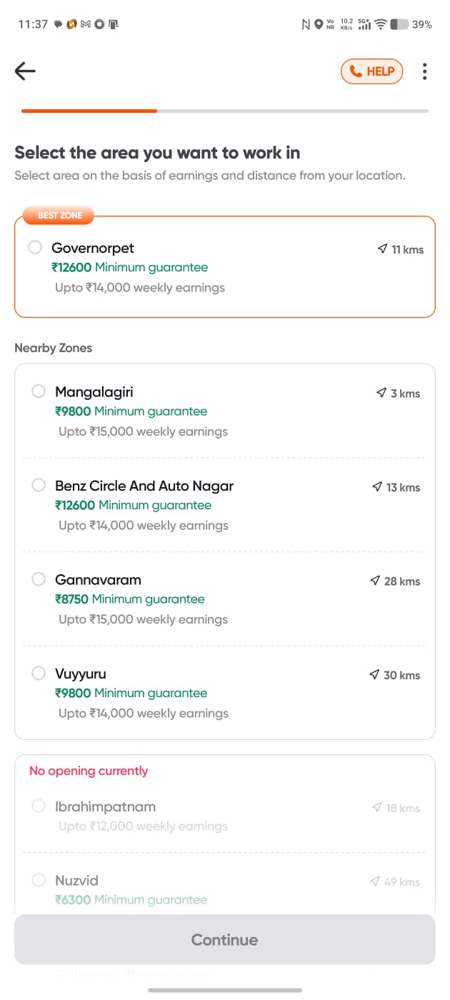
<p><em>Swiggy Partner App — Zone selection during onboarding. Worker is assigned a zone, not free-roaming.</em></p>

</div>

Once a zone is assigned, the platform enforces hard geographic boundaries:

<div align="center">

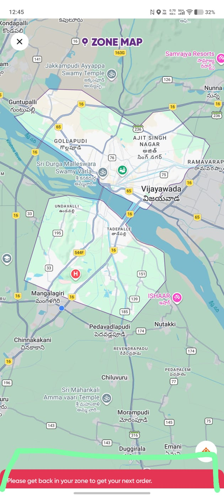
<p><em>Swiggy Zone Map — polygon-bounded delivery zones. Outside the boundary: "Please get back to your zone to get your next order."</em></p>

</div>

Zone changes are **locked for a minimum of 7 days** after joining:

<div align="center">

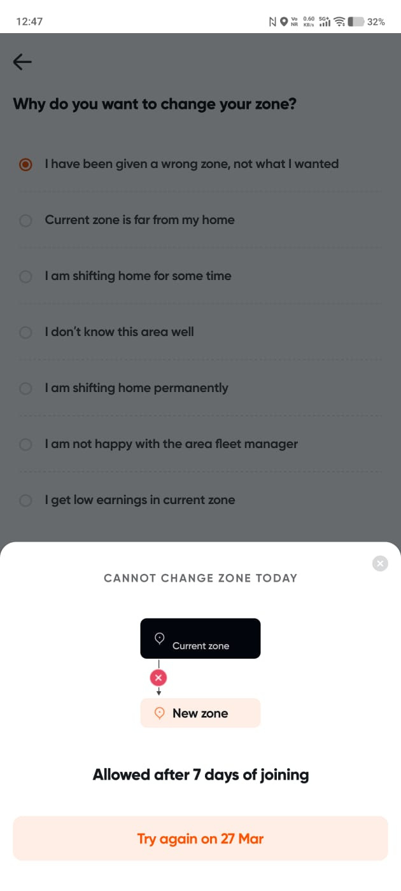
<p><em>Zone change blocked — "Allowed after 7 days of joining. Try again on 27 Mar."</em></p>

</div>

Adding secondary zones requires a separate support request — approved only the
next afternoon, with 30-day tenure requirements:

<div align="center">

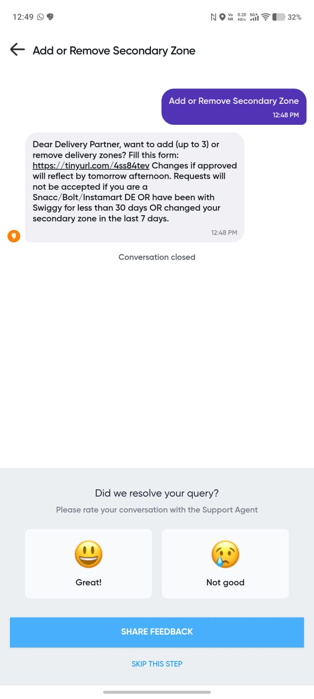
<p><em>Secondary zone request via support — not instant, subject to eligibility checks.</em></p>

</div>

---

**What this means for Rakshak's 11:50 PM reconciliation:**
```
Spoofed GPS zone:          Hyderabad — Banjara Hills
Worker's platform zone:    Mangalagiri, Vijayawada (on record)

→ Platform delivery API returns:  ZERO sessions in Banjara Hills
→ Zero sessions                =  Zero income to have lost
→ Zero payout. GPS coordinate is irrelevant.
```

| Signal | ✅ Genuine Worker | ❌ GPS Spoofer |
|--------|-----------------|--------------|
| Platform zone assignment | Matches disruption zone | Different zone on record |
| Delivery sessions in zone | Present — platform routes orders | Zero — platform blocks orders outside assigned zone |
| Zone change recency | Normal tenure | Suspiciously recent or ineligible |
| 30-day delivery history in zone | Consistent pattern | First appearance = payout event |

**Why this closes the final gap:**

Traditional parametric insurance has no access to this layer — they only see GPS
coordinates. Rakshak's reconciliation engine cross-checks the **platform's own
zone-session data**, enforced server-side by Swiggy/Zomato — not the worker's phone.
```
A spoofer cannot fake a Swiggy delivery session
in a zone they are not platform-assigned to.

The platform won't route orders to them there.
No orders → No session → No income loss → No payout.
```

> This is not a Rakshak defence. This is the platform's own architecture
> acting as our strongest verification layer — and we built our reconciliation
> engine to exploit it fully.
 
---
 
---

## 15. Team Details (Flexible Roles)

| Name | Role(Primary) |
|------|------|
| *K V Mithilesh* | Team Lead/AIML Engineer |
| *SK Mohammad* | Backend/AIML |
| *T Suman yadav* | Backend/AIML |
| *Praveen Ramisetty* | Frontend/Backend |
| *Ch Yaswitha* | Frontend/Database |

**University:** SRM University AP
**Hackathon:** Guidewire DEVTrails 2026

---
```
╔══════════════════════════════════════════════════════════════╗
║  The difference between Rakshak and every other parametric   ║
║  insurance product:                                          ║
║                                                              ║
║  We don't pay because it rained.                             ║
║  We pay because YOU lost income when it rained.              ║
║  And we prove it with data before transferring a rupee.      ║
╚══════════════════════════════════════════════════════════════╝
 
Guidewire DEVTrails 2026 
```
